# 

Introduction
=================

> * I made a vecihi that provides your own photo sharing app like Instagram in 5 minutes for ios and android. In app side, i used react-native also django for the backend side. Also, many components can be used for your own startup or new project. *

# 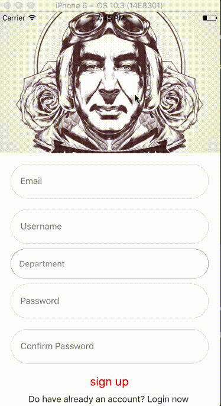

## Table of Contents
- [Installation](#installation)
- [Deployment](#deployment)
- [TODO](#todo)
- [Getting Started](#getting-started)
- [Features](#features)
- [Screens](#screens)
- [Contributing](#contributing)
- [License](#license)


## Installation

**For Backend :**
Before start, please cd into `Backend` folder. I didn't want to split backend and front-end in the different repository.

```
virtualenv env -p python2
source env/bin/active
pip install -r requirements.txt
python manage.py migrate
python manage.py createsuperuser
python manage.py runserver --settings='config.settings.local'

```

**For React Native :**
```
npm install
react-native link
react-native run-android or
react-native run-ios

```

## Deployment
Before start, please change `Backend/ansible/hosts` and `Backend/ansible/vars.yml` with your own infos.

```
ansible-playbook -i hosts deploy.yml -v
ansible-playbook -i hosts provision.yml   -v

```
When the installation completed, add your api url to `config.py`.

## TODO

- [ ] Real time chat
- [ ] Videos Support
- [ ] Stories (I've already implemented it but not yet used)
- [ ] Change our Components with Presentational and Container Components [Dan Abramov's article] (https://medium.com/@dan_abramov/smart-and-dumb-components-7ca2f9a7c7d0)
- [ ] Use Redux (Why I didn't use in the first init I dont know :()

## Getting Started

Before start, you should add your server ip adress (http://127.0.0.1:8000/ or server ip) to `config.js`

## Features

### Take or upload a photo
#### 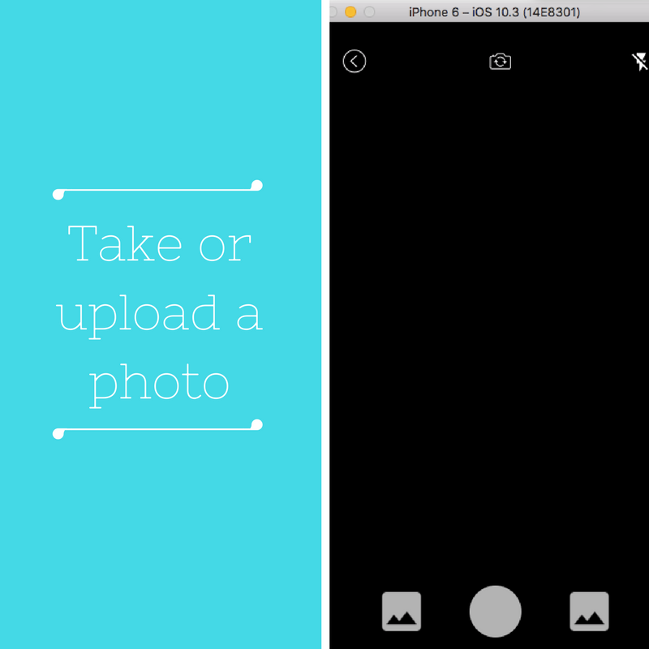

### See Who Visited Your Profile 
#### 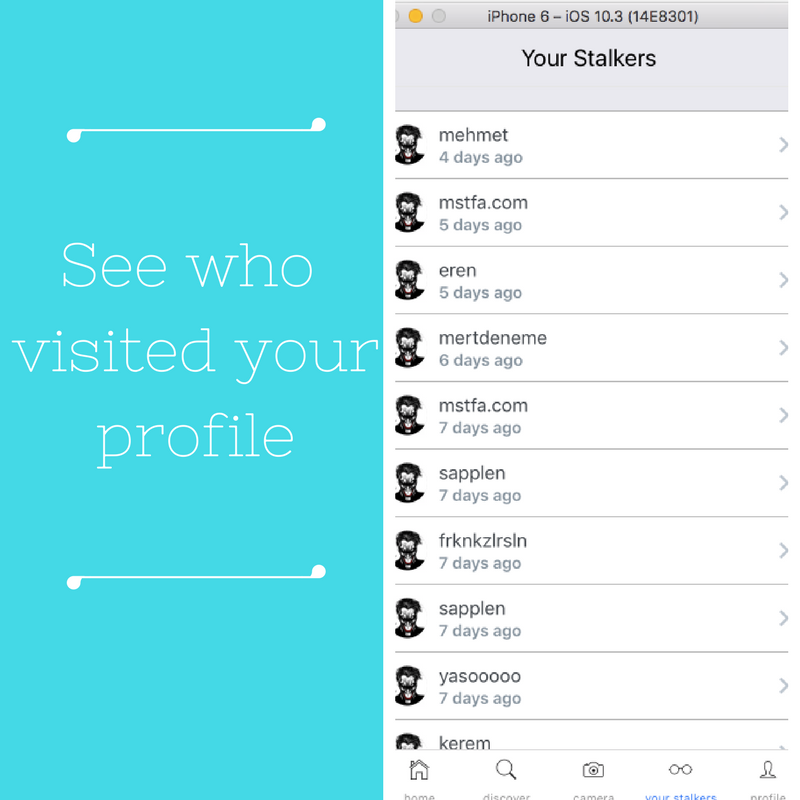

### Discover Most Popular Posts
#### 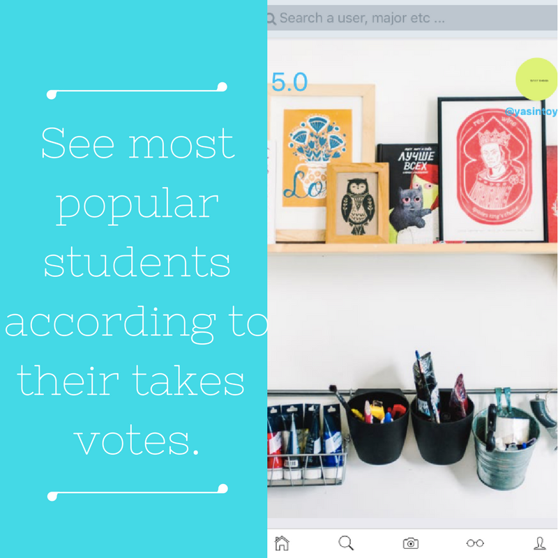

### Vote Images and see avarage points
#### 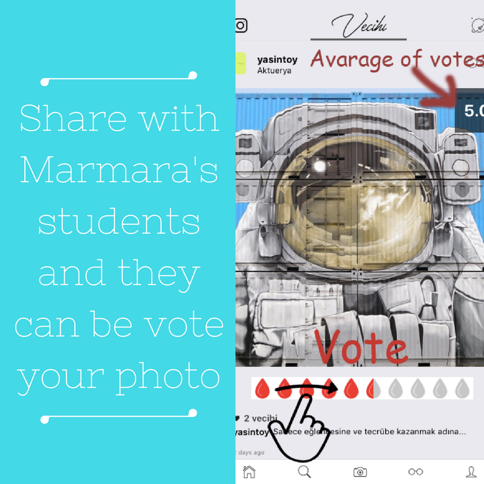

### No Private Profile
#### 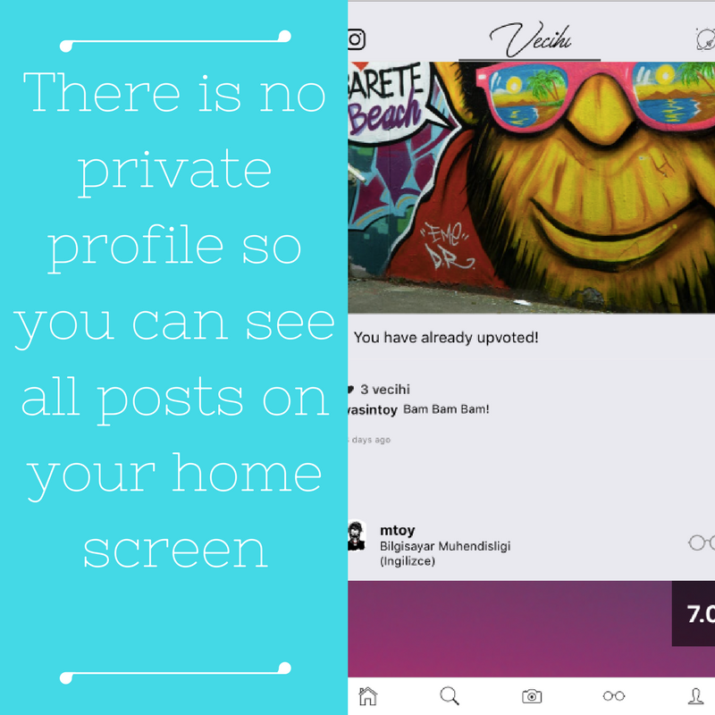

### Django provides a admin page for you
#### 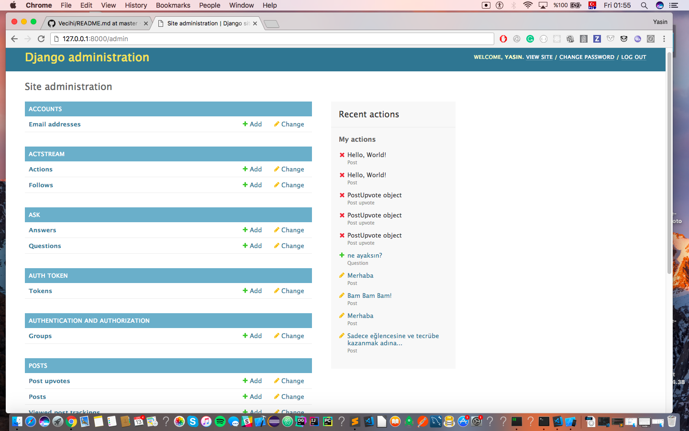

### Api Documentation (You can see list of api urls)
#### 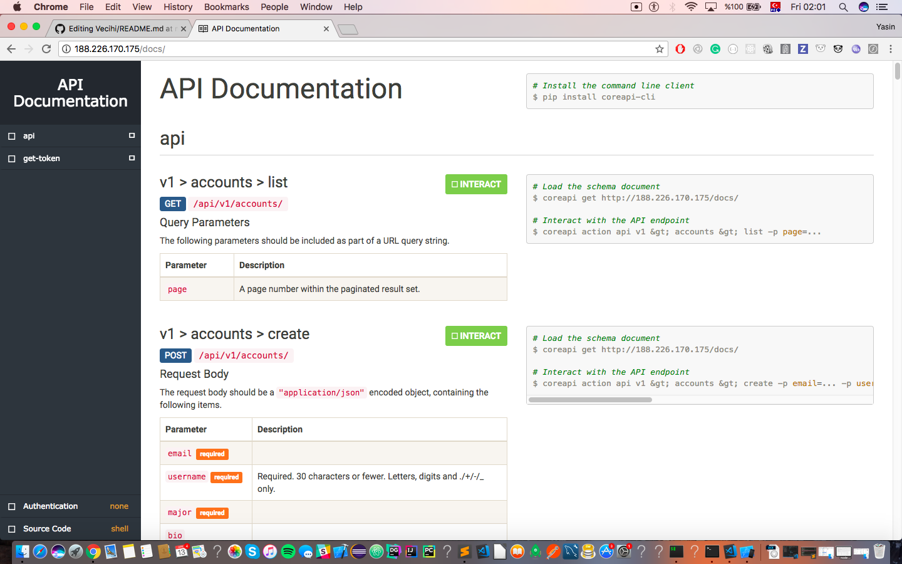

### Api Call Example
#### 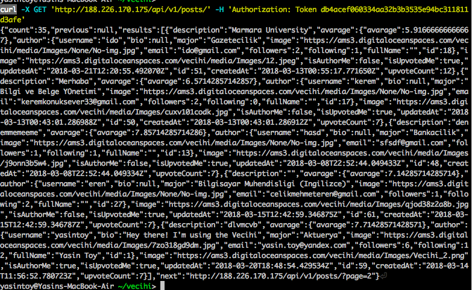

## Screens

### Splash
#### 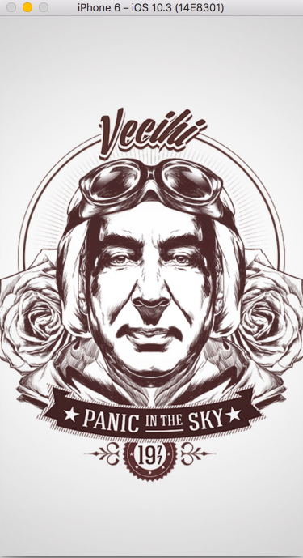

### Register
`Department field is university major. If you don't want use in your own project, you can remove( Be sure that you changed required=False in backend Side. I'll handle with this in the future)`

#### 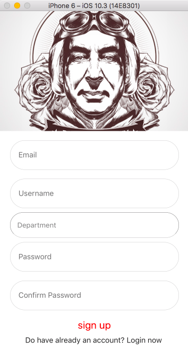

### Login
#### 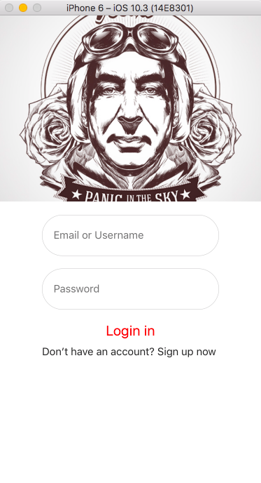

### Home
#### 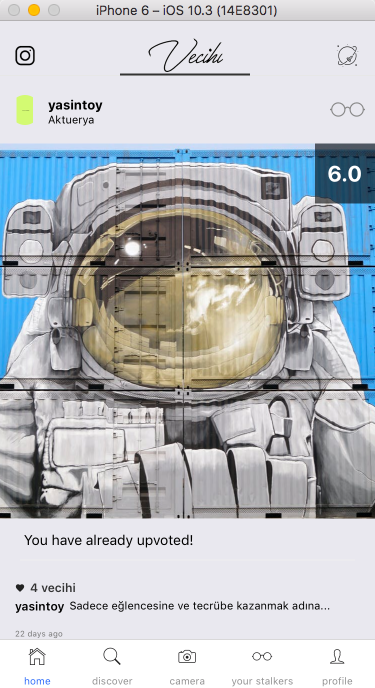

### Post Detail
#### 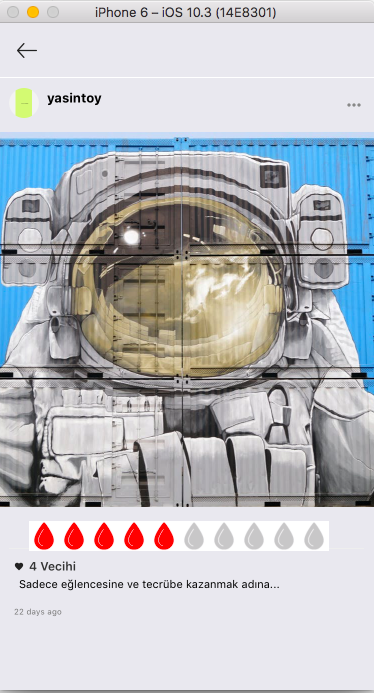

### Discover
#### 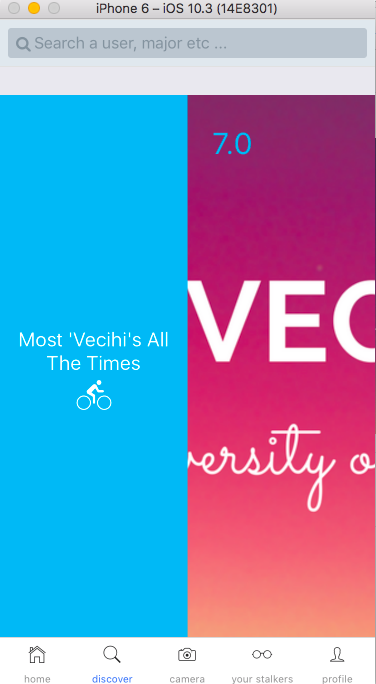

### Profile
#### 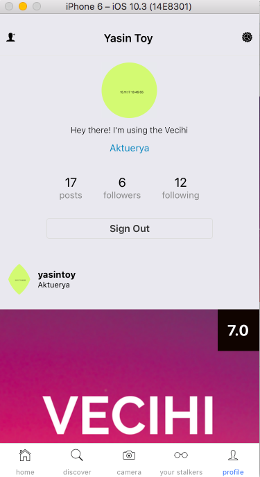

### Camera
#### 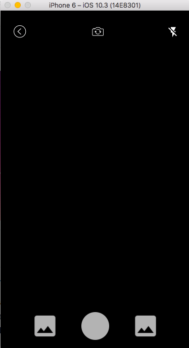

### Photo Library
#### 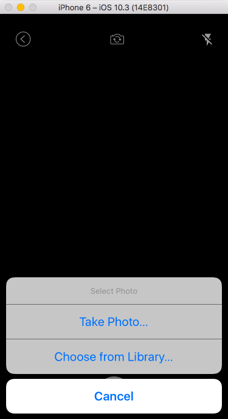

### Preview
#### 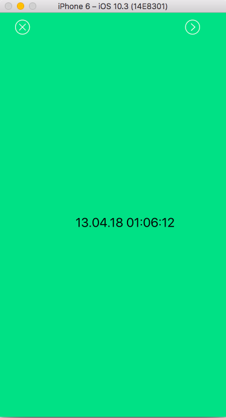

### Edit
#### 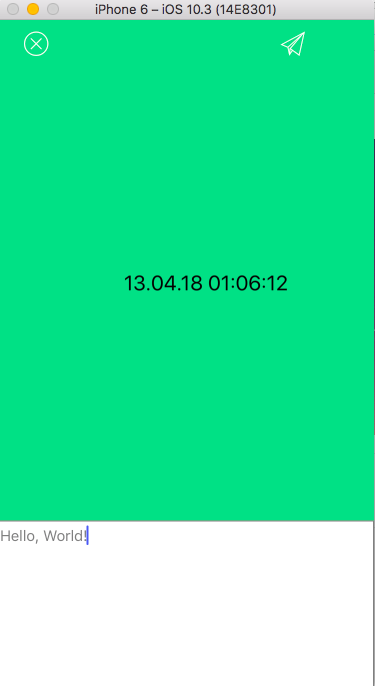

### Who Visited Your Profile
#### 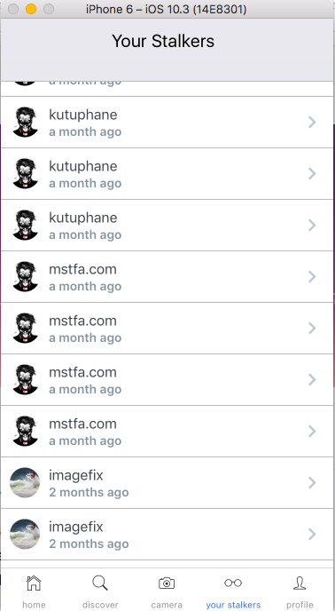

### Edit Your Profile
#### 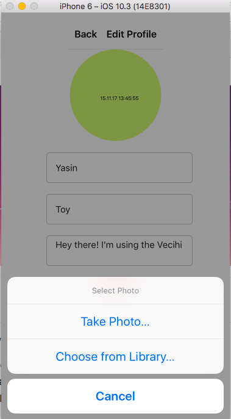


## Contributing 
- Fork the repo
- Branch it in your development environment (this is required if only you are willing to contribute frequently)
- Hack in
- Make a pull request
- Chill

## License
MIT License

Copyright (c) 2018 Yasin Toy

Permission is hereby granted, free of charge, to any person obtaining a copy
of this software and associated documentation files (the "Software"), to deal
in the Software without restriction, including without limitation the rights
to use, copy, modify, merge, publish, distribute, sublicense, and/or sell
copies of the Software, and to permit persons to whom the Software is
furnished to do so, subject to the following conditions:

The above copyright notice and this permission notice shall be included in all
copies or substantial portions of the Software.

THE SOFTWARE IS PROVIDED "AS IS", WITHOUT WARRANTY OF ANY KIND, EXPRESS OR
IMPLIED, INCLUDING BUT NOT LIMITED TO THE WARRANTIES OF MERCHANTABILITY,
FITNESS FOR A PARTICULAR PURPOSE AND NONINFRINGEMENT. IN NO EVENT SHALL THE
AUTHORS OR COPYRIGHT HOLDERS BE LIABLE FOR ANY CLAIM, DAMAGES OR OTHER
LIABILITY, WHETHER IN AN ACTION OF CONTRACT, TORT OR OTHERWISE, ARISING FROM,
OUT OF OR IN CONNECTION WITH THE SOFTWARE OR THE USE OR OTHER DEALINGS IN THE
SOFTWARE.
